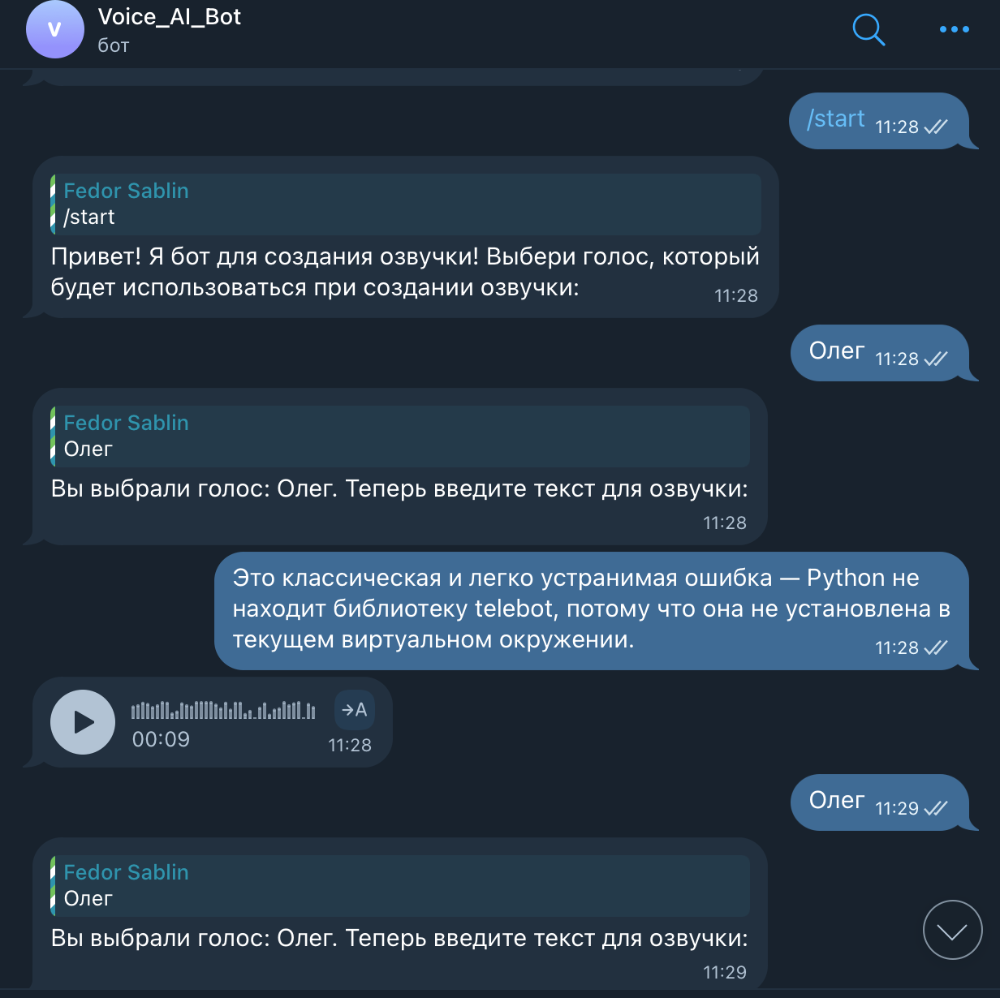

# 🤖 Telegram Voice Bot 🎙  
Бот для озвучивания текста с помощью Yandex SpeechKit — отправляет голосовые сообщения или mp3-файлы.


---

## 📲 Попробовать в Telegram

➡️ [@Speach_to_Text_AI_Bot](https://t.me/Speach_to_Text_AI_Bot)

---

## 📸 Превью

| Интерфейс бота | Пример MP3 | Пример Voice |
|----------------|------------|---------------|
|  |  |  |

> Еще скриншоты в папке /screenshots

---

## 🚀 Возможности
- 🔘 Выбор голосов: Алиса, Олег, Женя
- 🗣️ Поддержка голосовых сообщений (OGG)
- 💾 Возможность сохранить результат в MP3
- 📲 Удобное меню и кнопки
- 🇷🇺 Поддержка русского языка
- 🧠 Использует Yandex SpeechKit API

---

## ⚙️ Установка

1. Склонируйте репозиторий:
```bash
git clone https://github.com/FedorSablin/telegram-voice-bot.git
cd telegram-voice-bot
```

2. Установите зависимости:
```bash
pip install -r requirements.txt
```

3. Заполните `config.py`:
```python
bot_token = "ВАШ_ТЕЛЕГРАМ_ТОКЕН"
yandex_api_key = "ВАШ_IAM_ТОКЕН"
```

4. Запустите:
```bash
python bot.py
```

---

## 📎 Использование

- Команда `/start` → выбрать голос
- Отправить текст → получить озвучку
- Кнопка "Скачать как MP3" переключает формат

---

## 💬 Команды

| Команда     | Описание                              |
|-------------|----------------------------------------|
| `/start`    | Запуск бота и выбор голоса             |
| `/help`     | Инструкция по использованию            |
| `/about`    | Описание функционала бота              |


---

## 🧑‍💻 Автор

Создан с душой ❤️ — [FedorSablin](https://github.com/FedorSablin/)

---

## 🪪 Лицензия

MIT — используйте, развивайте, делитесь!
